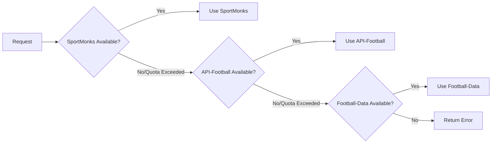

# SportMonks API Setup Guide

This guide will help you set up the SportMonks API as the primary data provider for your Sport Soccer Livescore application.

## ✅ What We've Done

1. **Added SportMonks as Primary API Provider**
   - SportMonks is now configured with highest priority in the backend
   - Automatic fallback to API-Football and Football-Data.org if needed
   - Smart quota management across all three providers

2. **Created API Status Dashboard**
   - View real-time API usage in Settings tab
   - See quota consumption for all providers
   - Visual indicators for API health

3. **Removed Mock Data**
   - All mock data fallbacks have been removed
   - App now shows real live data only
   - Clean error messages when no data is available

## 🔧 Setup Instructions

### Step 1: Configure Your API Key

Your SportMonks API key is already included in this setup:
```
DEIlvx84BFPHnraxU14OKUAwmneXhTznnxDZl4g21EPIbgpc2ruDeamDCyMD
```

#### Option A: Automated Setup (Recommended)
```bash
cd backend
node setup-env.js
```
The script will:
- Guide you through API key configuration
- Use your SportMonks key as the primary provider
- Optionally add secondary API keys
- Create the .env file automatically

#### Option B: Manual Setup
1. Create a `.env` file in the `backend` directory:
```bash
cd backend
cp .env.example .env
```

2. Edit `.env` and add your API key:
```env
# Primary API - SportMonks (Highest priority)
SPORTMONKS_API_KEY=DEIlvx84BFPHnraxU14OKUAwmneXhTznnxDZl4g21EPIbgpc2ruDeamDCyMD
SPORTMONKS_DAILY_LIMIT=3000

# Secondary APIs (Optional)
API_FOOTBALL_KEY=your_key_here_or_leave_empty
FOOTBALL_DATA_KEY=your_key_here_or_leave_empty
```

### Step 2: Install Dependencies

Make sure all dependencies are installed:

```bash
# Backend dependencies
cd backend
npm install

# Frontend dependencies (if needed)
cd ..
npm install
```

### Step 3: Start the Backend Server

```bash
cd backend
npm start
```

The server will start on `http://localhost:3000`

### Step 4: Start the Mobile App

In a new terminal:

```bash
# From the project root
npx expo start
```

## 📊 API Provider Priority

The system automatically selects the best API based on:

1. **SportMonks** (Primary) - 3000 requests/day
   - Used for all data types first
   - Best coverage and most reliable
   - ⭐ Your current configuration

2. **API-Football** (Secondary) - 100 requests/day  
   - Fallback for live scores and fixtures
   - Used when SportMonks quota is exceeded

3. **Football-Data.org** (Tertiary) - 10 requests/day
   - Final fallback for standings and team data
   - Limited quota, used sparingly

## 🎯 Using the API Status Dashboard

1. Open the app and navigate to **Settings** tab
2. Scroll to **API PROVIDERS** section
3. You'll see:
   - Current usage for each provider
   - Remaining quota
   - Visual health indicators
   - Refresh button to update status

**Status Indicators:**
- 🟢 **Good** - Under 50% usage
- 🟡 **Moderate** - 50-70% usage
- 🟠 **High Usage** - 70-90% usage
- 🔴 **Critical** - Over 90% usage

## 🔄 How API Fallback Works



## 📝 Environment Variables Reference

| Variable | Description | Default |
|----------|-------------|---------|
| `SPORTMONKS_API_KEY` | Your SportMonks API key | Required |
| `SPORTMONKS_DAILY_LIMIT` | Daily request limit | 3000 |
| `API_FOOTBALL_KEY` | API-Football key (optional) | - |
| `API_FOOTBALL_DAILY_LIMIT` | API-Football limit | 100 |
| `FOOTBALL_DATA_KEY` | Football-Data.org key (optional) | - |
| `FOOTBALL_DATA_DAILY_LIMIT` | Football-Data limit | 10 |

## 🚀 Testing the Integration

1. **Check Backend Health:**
   ```bash
   curl http://localhost:3000/health
   ```
   Should return: `{"success": true, "message": "Server is running"}`

2. **Check API Status:**
   ```bash
   curl http://localhost:3000/api/status
   ```
   Should return quota information for all providers

3. **Test Live Matches:**
   ```bash
   curl http://localhost:3000/api/matches/live
   ```

## 🐛 Troubleshooting

### Backend won't start
- Check if `.env` file exists in backend directory
- Verify all required environment variables are set
- Check console for error messages

### No data showing in app
- Open Settings → API Providers to check quota
- Verify backend is running on correct port
- Check frontend `config/api.ts` for correct backend URL

### API quota exceeded
- Check Settings → API Providers for usage stats
- Secondary APIs will be used automatically
- Quotas reset daily

## 📚 Additional Resources

- [SportMonks API Documentation](https://docs.sportmonks.com/)
- [API-Football Documentation](https://www.api-football.com/documentation-v3)
- [Football-Data.org Documentation](https://www.football-data.org/documentation/quickstart)

## 🎉 You're All Set!

Your app is now configured to use real live data from SportMonks API. The app will:
- ✅ Show real live scores and match data
- ✅ Automatically manage API quotas
- ✅ Fallback to secondary APIs when needed
- ✅ Display API status in settings

Enjoy your real-time football data! ⚽
